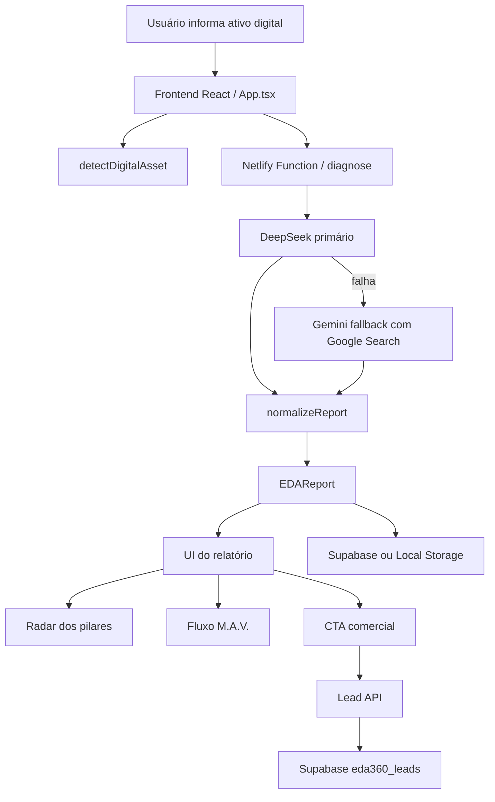
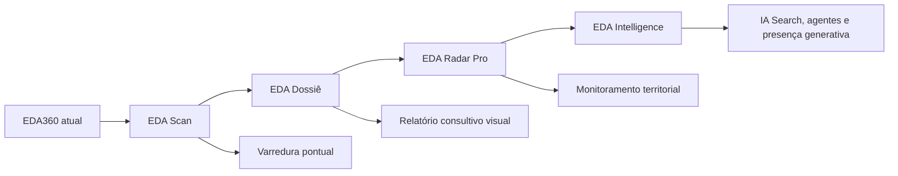
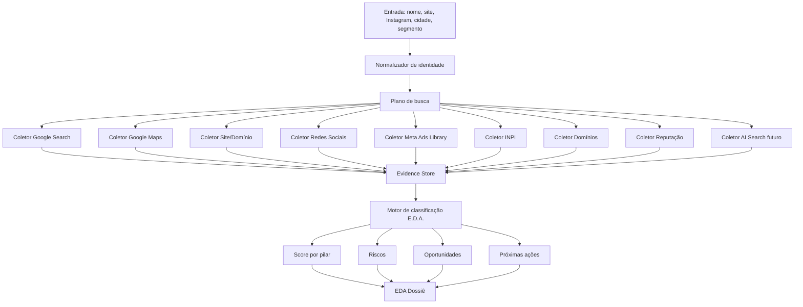
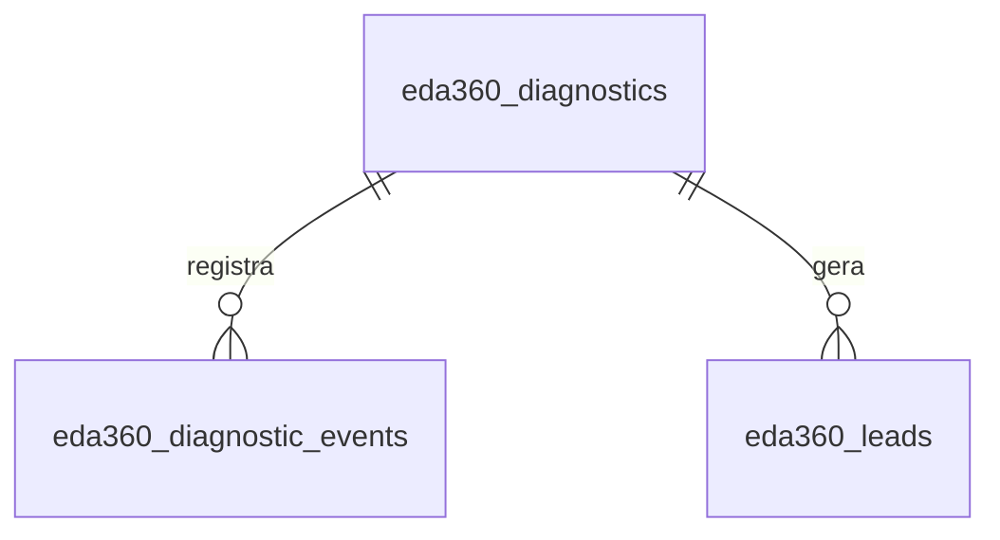
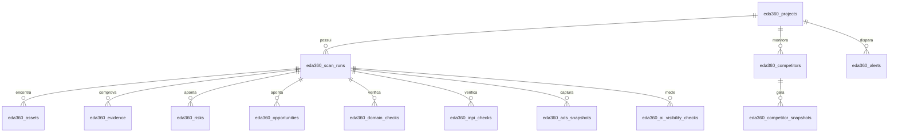
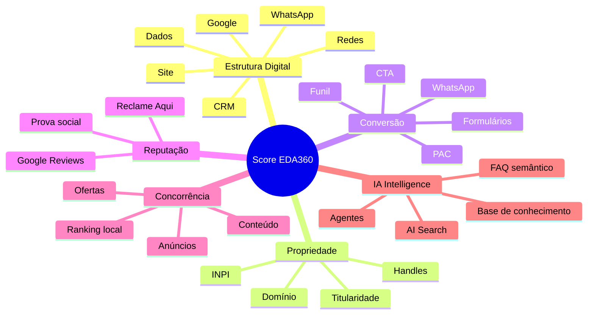
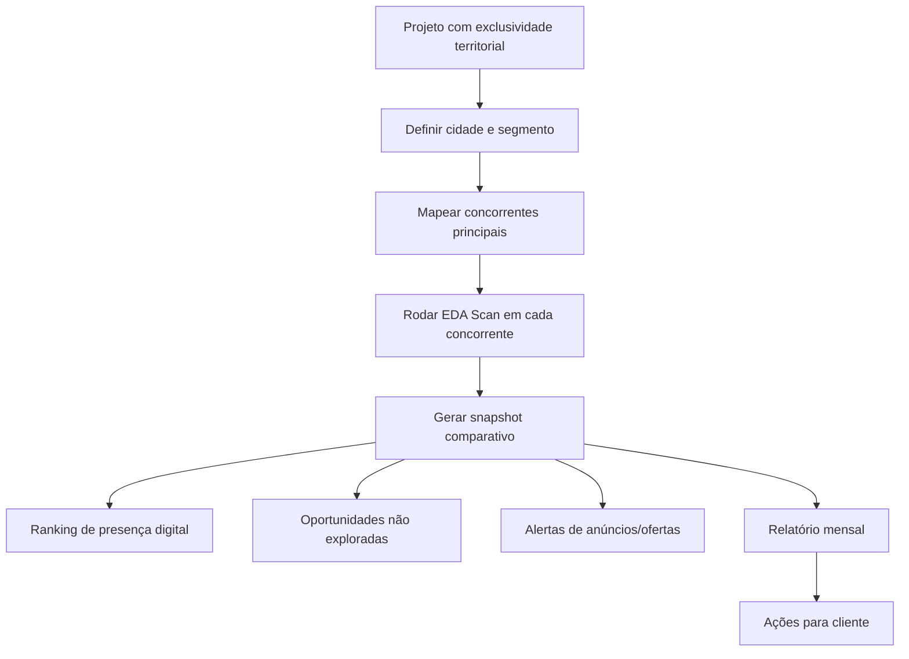
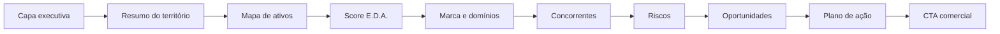
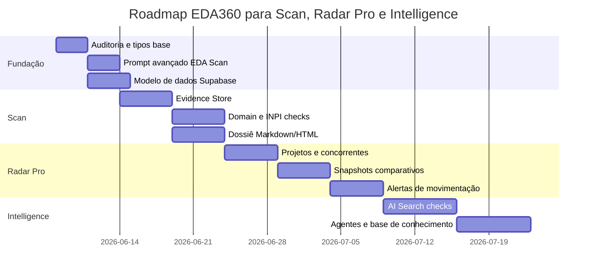

# EDA360 | Auditoria Técnica e Estratégica para EDA Scan, Dossiê, Radar Pro e Intelligence

**Projeto:** `GtegasB/eda_360`  
**Repositório analisado:** `github.com/GtegasB/eda_360`  
**Branch base:** `main`  
**Tipo:** relatório de auditoria + visão futura + tarefa técnica  
**Responsável metodológico:** Janot Frei  
**Solicitante:** Rodrigues  
**Versão:** v1.0  
**Data:** 08.06.2026

---

## 1. Resumo executivo

O projeto **EDA360** já existe como um aplicativo funcional de pré-diagnóstico da **E.D.A. — Estrutura Digital Avançada**.

Ele já possui:

| Frente | Status atual | Leitura |
|---|---:|---|
| Landing / formulário | 🟢 Existe | Já recebe ativo digital principal, cidade, segmento, contexto e entidades complementares |
| Diagnóstico por IA | 🟢 Existe | Usa Netlify Function com DeepSeek como motor principal e Gemini como fallback |
| 19 pilares E.D.A. | 🟢 Existe | Estrutura canônica está no `types.ts` |
| Radar visual dos pilares | 🟢 Existe | Já existe componente visual para mapa/radar da E.D.A. |
| Fluxo visual M.A.V. | 🟢 Existe | Já existe visualização de empresa, canais, marketing, vendas e expansão |
| Supabase | 🟡 Parcial | Salva diagnósticos, leads e eventos, mas ainda não estrutura radar competitivo |
| Histórico | 🟡 Parcial | Existe histórico de diagnósticos, mas não existe histórico comparativo de concorrentes |
| INPI / marca | 🔴 Não existe | Não há módulo de pré-análise pública de marca |
| Domínios | 🔴 Não existe | Não há módulo de domínio `.com.br`, `.com` e variações |
| Concorrentes | 🔴 Não existe | Não há módulo de concorrentes por cidade/território |
| Monitoramento recorrente | 🔴 Não existe | Não há scheduler, snapshots, alertas ou radar contínuo |
| Busca com IA / AI Visibility | 🔴 Não existe | Ainda não mede presença em ChatGPT, Gemini, Perplexity, Google AI etc. |
| Dossiê avançado em MD/HTML/PDF | 🔴 Não existe | Relatório atual é bom para pré-diagnóstico, mas não é dossiê consultivo/profundo |

### Diagnóstico central

O sistema atual está bom para **EDA360 como isca e pré-diagnóstico gratuito**, mas ainda não está pronto para ser o **mega agente de escaneamento, dossiê e monitoramento territorial** que estamos desenhando.

A evolução correta é transformar o EDA360 em uma arquitetura com quatro camadas:

1. **EDA Scan** — varredura pontual profunda.
2. **EDA Dossiê** — relatório consultivo visual e comercial.
3. **EDA Radar Pro** — monitoramento recorrente de concorrentes por cidade/território.
4. **EDA Intelligence** — camada futura de IA Search, agentes, presença generativa e automações inteligentes.

---

## 2. Base metodológica que deve guiar o sistema

A tese que precisa continuar guiando tudo é:

> **Ter canais não é ter estrutura.**

A E.D.A. não pode ser reduzida a “tem Instagram”, “tem site”, “tem WhatsApp” ou “tem Google”. Ela precisa analisar se os ativos digitais estão organizados, conectados, rastreáveis, protegidos, documentados e úteis para marketing, vendas, atendimento, governança e crescimento.

A M.A.V. complementa essa lógica: uma empresa pode ter canais e ainda assim não ter máquina. O problema não é só ausência de canal, mas canal solto, sem conexão, sem rastreio, sem processo, sem responsável, sem funil e sem clareza de função.

---

## 3. Como o sistema está hoje

### 3.1 Visão macro atual



### 3.2 O que já está bom

| Área | O que existe | Por que é bom |
|---|---|---|
| Produto | EDA360 posicionado como pré-diagnóstico | Bom para entrada comercial e geração de lead |
| Input | Aceita Instagram, site, WhatsApp, Google ou nome da empresa | Boa lógica de entrada flexível |
| IA | DeepSeek + Gemini fallback | Arquitetura inicial razoável de resiliência |
| Estrutura | 19 pilares E.D.A. | Base metodológica já formalizada |
| Visual | RadarNetwork e FluxoMAV | Já existe base visual para explicar estrutura |
| Dados | Supabase opcional + fallback local | Evita travar se Supabase não estiver configurado |
| Leads | Captura comercial via Netlify Function | Já transforma diagnóstico em oportunidade |
| Eventos | Rastreamento de eventos | Início de funil analítico |

### 3.3 O que está fraco

| Área | Fragilidade | Impacto |
|---|---|---|
| Pesquisa pública | DeepSeek é motor principal sem busca pública nativa | Pode gerar diagnóstico inferido demais e pouco evidenciado |
| Gemini | Só entra como fallback | A busca real deveria ser parte central do Scan, não plano B |
| Prompt | Foi desenhado para pré-diagnóstico enxuto | Não serve ainda para dossiê profundo |
| Schema | Não contempla INPI, domínio, concorrentes, anúncios, AI Search | Não comporta a visão nova |
| Supabase | Só salva diagnóstico, lead e eventos | Não sustenta radar, snapshots e monitoramento recorrente |
| Concorrência | Ausente | Não atende planos Pro com exclusividade territorial |
| Marca/domínio | Ausente | Perde uma camada decisiva de proteção patrimonial |
| Relatório | Focado em maturidade e gaps | Ainda não vira “dossiê de guerra” visual para venda consultiva |
| Governança | Não há separação clara entre Scan, Dossiê, Radar e Intelligence | Risco de o produto crescer bagunçado |

---

## 4. Arquitetura ideal futura

### 4.1 Camadas do produto



### 4.2 Definição de cada camada

| Camada | Função | Uso comercial | Status no repo |
|---|---|---|---|
| **EDA360** | Pré-diagnóstico gratuito | Isca, lead, consciência de gaps | 🟢 Existe |
| **EDA Scan** | Escaneamento profundo de ativos públicos | Diagnóstico de cliente, lead ou concorrente | 🔴 Precisa criar |
| **EDA Dossiê** | Relatório visual com evidências, riscos e oportunidades | Reunião comercial, onboarding, consultoria | 🔴 Precisa criar |
| **EDA Radar Pro** | Monitoramento recorrente de concorrentes por cidade | Planos Pro, exclusividade territorial | 🔴 Precisa criar |
| **EDA Intelligence** | Busca com IA, agentes, SEO para IA e respostas generativas | Produto premium futuro | 🔴 Precisa desenhar |

---

## 5. Nova arquitetura do motor de escaneamento

### 5.1 Fluxo ideal do EDA Scan



### 5.2 Regra nova do motor

O motor não deve mais depender apenas de uma resposta textual da IA.

Ele precisa trabalhar em três etapas:

1. **Coleta de evidências públicas**  
   Links, fontes, dados, prints futuros, resultados públicos, anúncios, domínios, INPI e redes.

2. **Normalização estruturada**  
   Transformar evidência em ativos, canais, riscos, status e confiança.

3. **Interpretação por IA**  
   A IA deve interpretar evidências, não inventar presença digital.

---

## 6. Modelo de dados recomendado

### 6.1 Estrutura atual percebida

Hoje o projeto trabalha principalmente com:



### 6.2 Estrutura futura recomendada



### 6.3 Tabelas recomendadas

> Regra obrigatória: como o Supabase pode ser compartilhado, tudo deve usar prefixo `eda360_`.

| Tabela | Função |
|---|---|
| `eda360_projects` | Cliente/projeto monitorado |
| `eda360_scan_runs` | Cada execução do Scan/Dossiê/Radar |
| `eda360_assets` | Ativos digitais encontrados |
| `eda360_evidence` | Evidências com fonte, link e confiança |
| `eda360_risks` | Riscos identificados |
| `eda360_opportunities` | Oportunidades identificadas |
| `eda360_domain_checks` | Consulta de domínio e variações |
| `eda360_inpi_checks` | Pré-análise pública de marca |
| `eda360_competitors` | Concorrentes monitorados |
| `eda360_competitor_snapshots` | Estado de cada concorrente em cada período |
| `eda360_ads_snapshots` | Anúncios públicos encontrados |
| `eda360_ai_visibility_checks` | Visibilidade em mecanismos de IA |
| `eda360_alerts` | Alertas de mudança relevante |
| `eda360_dossiers` | Relatórios gerados em Markdown/HTML/PDF |

---

## 7. Novo modelo de pontuação

O score atual avalia 19 pilares, mas a próxima versão precisa separar pontuações.



### 7.1 Scores sugeridos

| Score | O que mede |
|---|---|
| `score_eda_base` | Estrutura digital tradicional |
| `score_propriedade` | Marca, domínio, handles, titularidade |
| `score_conversao` | Captação, formulário, WhatsApp, CTA, CRM |
| `score_reputacao` | Avaliações, prova social, confiança pública |
| `score_concorrencia` | Força relativa no território |
| `score_ai_visibility` | Visibilidade e preparo para mecanismos de IA |
| `score_geral` | Síntese ponderada |

---

## 8. Radar Pro por cidade

### 8.1 Conceito

O **EDA Radar Pro** deve ser a camada premium para planos com exclusividade territorial, como:

- 3forB Odonto;
- 3forB Odonto Pro;
- Imóveis Pro;
- clínicas;
- corretores/imobiliárias;
- negócios locais com disputa regional.

Ele monitora o território digital do cliente e compara com os principais concorrentes públicos da cidade.

### 8.2 Fluxo do Radar Pro



### 8.3 O que o Radar deve monitorar

| Frente | O que observar |
|---|---|
| Google Maps | Posição, avaliações, notas, fotos, dados inconsistentes |
| Site | Presença, velocidade aparente, CTA, WhatsApp, landing pages |
| Instagram | Bio, links, campanhas, oferta, frequência aparente |
| WhatsApp | Clareza de botão, link, consistência por canal |
| Anúncios | Meta Ads Library, ofertas ativas, criativos públicos |
| Domínios | `.com.br`, `.com`, variações e riscos |
| Marca | INPI, nomes parecidos, risco preliminar |
| Conteúdo | Temas explorados, autoridade, dúvidas respondidas |
| Conversão | Formulários, páginas, agendamento, proposta |
| IA Search | Se aparece/é compreendido por mecanismos de resposta |

---

## 9. Dossiê visual ideal

O relatório final do EDA Scan / Radar deve ser mais forte que o relatório atual.

### 9.1 Estrutura recomendada do Dossiê



### 9.2 Blocos do Dossiê

| Bloco | Conteúdo |
|---|---|
| Capa | Cliente, cidade, segmento, data, tipo de scan |
| Resumo executivo | Achados principais em linguagem simples |
| Mapa E.D.A. | 19 pilares com status visual |
| Mapa de ativos | Site, Google, redes, WhatsApp, domínio, CRM, anúncios |
| Mapa de propriedade | Domínio, INPI, handles, titularidade aparente |
| Mapa competitivo | Concorrentes e comparação por canal |
| Matriz de risco | Vermelho, amarelo, verde |
| Matriz de oportunidade | O que o cliente pode explorar antes dos concorrentes |
| Evidências | Links e fontes públicas |
| Plano inicial | Criar, ajustar, fortalecer |
| Próximo passo | Sessão estratégica, implantação E.D.A., plano Pro |

---

## 10. Lacunas em relação à visão do Rodrigues

| Ideia do Rodrigues | Status no sistema atual | O que fazer |
|---|---:|---|
| Escanear qualquer cliente, lead ou concorrente | 🟡 Parcial | A entrada existe, mas precisa motor mais forte e evidências |
| Ver E.D.A. completa | 🟡 Parcial | Os 19 pilares existem, mas faltam subcamadas de prova |
| Ver marca, INPI e domínio | 🔴 Ausente | Criar módulo de propriedade e proteção de marca |
| Ver `.com.br` e `.com` | 🔴 Ausente | Criar domain checker e recomendação de compra/redirecionamento |
| Ver concorrentes da cidade | 🔴 Ausente | Criar projects + competitors + snapshots |
| Monitorar anúncios públicos | 🔴 Ausente | Criar ads snapshots e integração com fonte pública |
| Monitorar radar contínuo | 🔴 Ausente | Criar agendamento, histórico, alertas e comparativos |
| Ver presença em IA Search | 🔴 Ausente | Criar módulo futuro EDA Intelligence |
| Gerar dossiê visual em MD/HTML/PDF | 🔴 Ausente | Criar report builder avançado |
| Criar argumento Pro com exclusividade | 🔴 Ausente | Criar Radar Pro como módulo premium |

---

## 11. Riscos técnicos atuais

| Risco | Descrição | Prioridade |
|---|---|---:|
| Diagnóstico sem evidência suficiente | DeepSeek primário pode gerar inferência sem busca pública | Alta |
| Schema limitado | Estrutura atual não comporta INPI, domínio, concorrência e snapshots | Alta |
| Banco limitado | Supabase atual só cobre diagnóstico, lead e eventos | Alta |
| Prompt limitado por intenção comercial | Prompt atual evita profundidade, correto para isca, fraco para dossiê | Média |
| Duplicidade de serviços | Existem serviços antigos e função atual, podendo gerar confusão | Média |
| Sem multi-tenant robusto | Ainda não há projeto/cliente/território como unidade central | Alta |
| Sem controle de recorrência | Não há rotina de monitoramento | Alta |
| Sem governança jurídica | INPI precisa ser tratado como pré-análise, não parecer jurídico | Alta |

---

## 12. Recomendação de arquitetura de produto

### 12.1 Nomes provisórios

| Nome | Papel |
|---|---|
| **EDA360** | Produto guarda-chuva / app atual |
| **EDA Scan** | Varredura pontual profunda |
| **EDA Dossiê** | Relatório consultivo visual |
| **EDA Radar Pro** | Monitoramento recorrente territorial |
| **EDA Intelligence** | Camada futura com IA Search e agentes |

### 12.2 Leitura de marca

O nome **EDA360** ainda funciona como produto guarda-chuva, mas talvez não seja o melhor nome para o módulo de varredura profunda.

Sugestão:

- manter **EDA360** como plataforma;
- usar **EDA Scan** como ação de escaneamento;
- usar **EDA Radar Pro** como camada premium;
- usar **EDA Intelligence** para a versão com IA avançada.

---

## 13. Tarefa técnica recomendada

### Título da tarefa

**EDA360 | Scan e Radar Pro | ET 01/08 | Auditoria estrutural e base do novo motor de inteligência digital**

### Objetivo

Evoluir o EDA360 de um pré-diagnóstico gratuito para uma base preparada para:

1. escaneamento profundo de ativos digitais;
2. dossiê visual com evidências;
3. pré-análise pública de domínio e marca;
4. estrutura futura de concorrentes por cidade;
5. estrutura futura de Radar Pro recorrente.

### Escopo desta primeira etapa

Esta etapa **não deve implementar tudo de uma vez**.

Ela deve preparar a fundação técnica para o novo produto.

#### Entregas obrigatórias

1. Criar documentação técnica em `docs/` com a arquitetura futura do EDA Scan/Radar Pro.
2. Revisar o schema `EDAReport` e criar uma proposta de tipos para:
   - `BrandProtectionCheck`;
   - `DomainCheck`;
   - `CompetitorProfile`;
   - `CompetitiveSnapshot`;
   - `EvidenceItem`;
   - `ScanRun`;
   - `DossierSection`;
   - `AiVisibilityCheck`.
3. Criar nova estrutura de tipos sem quebrar o relatório atual.
4. Criar um novo prompt builder separado para o modo avançado:
   - `services/prompts/edaScanPrompt.ts`.
5. Criar um primeiro esqueleto do motor avançado:
   - `services/scan/scanTypes.ts`;
   - `services/scan/scanNormalizer.ts`;
   - `services/scan/scanPromptBuilder.ts`;
   - `services/scan/scanReportBuilder.ts`.
6. Criar migration SQL inicial sugerida para tabelas futuras com prefixo `eda360_`.
7. Manter o fluxo atual funcionando.
8. Não remover o diagnóstico público atual.
9. Não transformar o diagnóstico gratuito em relatório consultivo completo ainda.

### Estrutura esperada de arquivos

```text
/docs/
  eda360-scan-radar-pro-architecture.md
  eda360-data-model-v1.md

/services/
  /prompts/
    edaScanPrompt.ts
  /scan/
    scanTypes.ts
    scanNormalizer.ts
    scanPromptBuilder.ts
    scanReportBuilder.ts

/supabase/
  /migrations/
    eda360_20260608_scan_radar_foundation.sql
```

### Tipos mínimos esperados

```ts
export interface EvidenceItem {
  id: string;
  sourceType: 'website' | 'google' | 'social' | 'ads' | 'domain' | 'inpi' | 'directory' | 'ai_search' | 'manual';
  title: string;
  url?: string;
  confidence: 'high' | 'medium' | 'low';
  observedAt: string;
  notes?: string;
}

export interface DomainCheck {
  domain: string;
  extension: '.com.br' | '.com' | '.net' | '.io' | 'other';
  status: 'available' | 'registered' | 'unknown' | 'needs_manual_validation';
  recommendation: 'buy' | 'monitor' | 'redirect' | 'avoid' | 'validate';
  evidence?: EvidenceItem[];
}

export interface BrandProtectionCheck {
  searchedName: string;
  source: 'INPI' | 'manual' | 'other';
  status: 'not_found' | 'similar_found' | 'exact_found' | 'unknown' | 'needs_legal_review';
  riskLevel: 'low' | 'medium' | 'high' | 'needs_review';
  notes: string;
  evidence?: EvidenceItem[];
}

export interface CompetitorProfile {
  id: string;
  name: string;
  city?: string;
  segment?: string;
  website?: string;
  instagram?: string;
  googleBusinessUrl?: string;
  notes?: string;
}
```

### Critérios de validação

A etapa será considerada concluída quando:

- o app atual continuar buildando;
- os tipos novos não quebrarem o relatório atual;
- a documentação explicar claramente EDA360, EDA Scan, EDA Dossiê, EDA Radar Pro e EDA Intelligence;
- houver prompt avançado separado do prompt público atual;
- houver base de schema para domínio, INPI, concorrentes, evidências e AI Search;
- houver migration SQL proposta com prefixo `eda360_`;
- o relatório atual continuar funcionando como isca pública;
- ficar claro o que é gratuito e o que é premium/profundo.

### Comandos de validação

```bash
npm install
npm run typecheck
npm run build
npm run test
```

### Fechamento obrigatório do executor

Ao concluir, registrar:

1. O que foi feito.
2. Arquivos criados/alterados.
3. Comandos rodados e resultados.
4. O que ficou pendente.
5. O que faria diferente.
6. Cuidados técnicos para a próxima etapa.

---

## 14. Roadmap recomendado



---

## 15. Conclusão

O repositório `eda_360` está em um ponto muito bom para evoluir.

A base atual já tem:

- produto definido;
- pré-diagnóstico;
- IA;
- 19 pilares;
- relatório;
- visualizações;
- Supabase parcial;
- captura de lead;
- eventos.

Mas a visão nova exige uma evolução clara:

> sair de **pré-diagnóstico E.D.A.** para **plataforma de inteligência digital, propriedade de marca e radar competitivo territorial**.

O próximo passo correto é criar a fundação técnica sem bagunçar o que já funciona.

A tarefa recomendada é começar pela arquitetura, tipos, prompt avançado, modelo de dados e documentação. Depois disso, implementar EDA Scan, Dossiê, Radar Pro e Intelligence em fases.
